```{r, echo=FALSE, message=FALSE}
library(PortfolioAnalytics)
require(methods)
```


## Overview
* Discuss Portfolio Optimization
* Introduce PortfolioAnalytics
* Demonstrate PortfolioAnalytics with Examples

<!--
* Discuss Portfolio Optimization
    * Background and challenges of portfolio theory
* Introduce PortfolioAnalytics
    * What PortfolioAnalytics does and the problems it solves
* Demonstrate PortfolioAnalytics with Examples
    * Brief overview of the examples I will be giving
    * use random portfolios to explore the feasible space of constrained portfolios
    * demonstrate framework to solve hierarchical portfolio optimization problem
-->

---

## Modern Portfolio Theory
"Modern" Portfolio Theory (MPT) was introduced by Harry Markowitz in 1952.

In general, MPT states that an investor's objective is to maximize portfolio expected return for a given amount of risk.

Common Objectives

* Maximize a measure of gain per unit measure of risk
* Minimize a measure of risk

How do we define risk? What about more complex objectives and constraints?

<!--
Several approaches follow the Markowitz approach using mean return as a measure of gain and standard deviation of returns as a measure of risk. This is an academic approach. 
-->

---

## Portfolio Optimization Objectives
* Minimize Risk
    * Volatility
    * Tail Loss (VaR, ES)
    * Other Downside Risk Measure
* Maximize Risk Adjusted Return
    * Sharpe Ratio, Modified Sharpe Ratio
    * Several Others
* Risk Budgets
    * Equal Component Contribution to Risk (i.e. Risk Parity)
    * Limits on Component Contribution
* Maximize a Utility Function
    * Quadratic, Constant Relative Risk Aversion (CRRA), etc.

<!--
* Expand on pros/cons of closed-form solvers vs. global solvers and what objectives can be solved.
* The challenge here is knowing what solver to use and the capabilities/limits of the chosen solver. 
* Some of these problems can be formulated as a quadratic or linear programming problem. Constructing the constraint matrix and objective function matrix or vector is not trivial. Limited to the quality of LP and QP solvers available for R. 
-->

---

## PortfolioAnalytics Overview
PortfolioAnalytics is an R package designed to provide numerical solutions and visualizations for portfolio optimization problems with complex constraints and objectives.

Supports:
* multiple constraint and objective types
* modular constraints and objectives
* an objective function can be any valid R function
* user defined moment functions (e.g. covariance matrix, return projections)
* visualizations
* solver agnostic
* parallel computing

<!---
The key points to make here are:
* Flexibility
    * The multiple types and modularity of constraints and objectives allows us to add, remove, and combine multiple constraint and objective types very easily.
    * Define an objective as any valid R function
    * Define a function to compute the moments (sample, robust, shrinkage, factor model, GARCH model, etc.)
    * Estimation error is a significant concern with optimization. Having the ability to test different models with different parameters is critical.
* PortfolioAnalytics comes "out of the box" with several constraint types.
* Visualization helps to build intuition about the problem and understand the feasible space of portfolios
* Periodic rebalancing and analyzing out of sample performance will help refine objectives and constraints
* Framework for evaluating portfolios with different sets of objectives and portfolios through time

* Pushed to CRAN
* Regime Switching Framework
* Multilayer Optimization
* Rank Based Optimization
* Factor Model Moment Estimates
* Improved Random Portfolios Algorithm
* More demos, vignettes, and documentation

Highlight a few things about each point
* Pushed to CRAN
  * 2015-04-19
* Regime Switching Framework
  * very general framework to define 'n' portfolios for 'n' regimes
  * useful for out of sample backtesting
* Multilayer Optimization
  * more on this in next slide
* Rank Based Optimization
  * examples
* Factor Model Moment Estimates
  * statistical factor model
  * compute higher order moments based on the work of kris boudt
* Improved Random Portfolios Algorithm
  * support more constraints by construction
  * more efficient for group constraints
* More demos, vignettes, and documentation
  * added vignette for custom moments and objectives
  * demos for each new feature added last summer during GSoC 2014
-->

---

## Hierarchical (i.e. Multilayer) Optimization
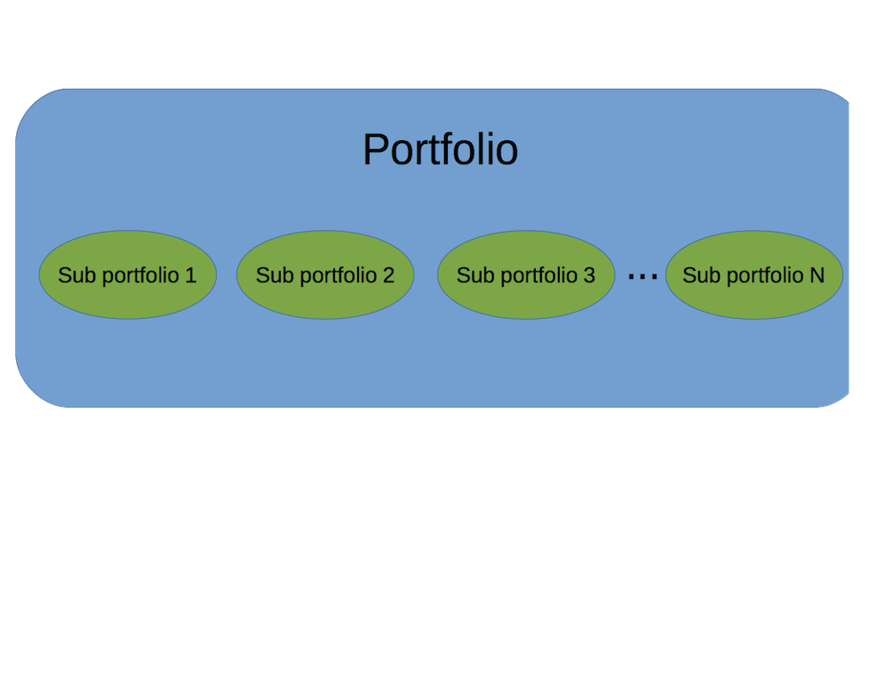

<!--
explanation of how the multilayer optimization works
start with portfolio of subportfolios
the subportfolios could be countries, sectors, strategies, etc.
optimize subportfolios
this gives us 'n' synthetic return streams for 'n' sub portfolios
we then optimize the top level portfolio using the 'n' synthetic return streams
-->

---

## Support Multiple Solvers
Linear and Quadratic Programming Solvers

* R Optimization Infrastructure (ROI)
    * GLPK (Rglpk)
    * Symphony (Rsymphony)
    * Quadprog (quadprog)

Global (stochastic or continuous solvers)

* Random Portfolios
* Differential Evolution (DEoptim)
* Particle Swarm Optimization (pso)
* Generalized Simulated Annealing (GenSA)

<!---
Brief explanation of each solver and what optimization problems are supported
-->

---

## Random Portfolios
PortfolioAnalytics has three methods to generate random portfolios.

1. The **sample** method to generate random portfolios is based on an idea by Pat Burns.
2. The **simplex** method to generate random portfolios is based on a paper by W. T. Shaw.
3. The **grid** method to generate random portfolios is based on the `gridSearch` function in the NMOF package.

<!--
* Random portfolios allow one to generate an arbitray number of portfolios based on given constraints. Will cover the edges as well as evenly cover the interior of the feasible space. Allows for massively parallel execution.

* The sample method to generate random portfolios is based on an idea by Patrick Burns. This is the most flexible method, but also the slowest, and can generate portfolios to satisfy leverage, box, group, and position limit constraints.

* The simplex method to generate random portfolios is based on a paper by W. T. Shaw. The simplex method is useful to generate random portfolios with the full investment constraint, where the sum of the weights is equal to 1, and min box constraints. Values for min_sum and max_sum of the leverage constraint will be ignored, the sum of weights will equal 1. All other constraints such as the box constraint max, group and position limit constraints will be handled by elimination. If the constraints are very restrictive, this may result in very few feasible portfolios remaining. Another key point to note is that the solution may not be along the vertexes depending on the objective. For example, a risk budget objective will likely place the portfolio somewhere on the interior.

* The grid method to generate random portfolios is based on the gridSearch function in NMOF package. The grid search method only satisfies the min and max box constraints. The min_sum and max_sum leverage constraint will likely be violated and the weights in the random portfolios should be normalized. Normalization may cause the box constraints to be violated and will be penalized in constrained_objective.
-->

---

## Comparison of Random Portfolio Methods (Interactive!)
```{r, results = 'asis', comment = NA, message = F, echo = F}
load("figures/rp_viz.rda")
rp_viz$show('inline')
```

<!--
The feasible space is computed using the the first 5 assets of the EDHEC data
for a long only portfolio with a search size of 2000.
-->

---

## Random Portfolios: Simplex Method
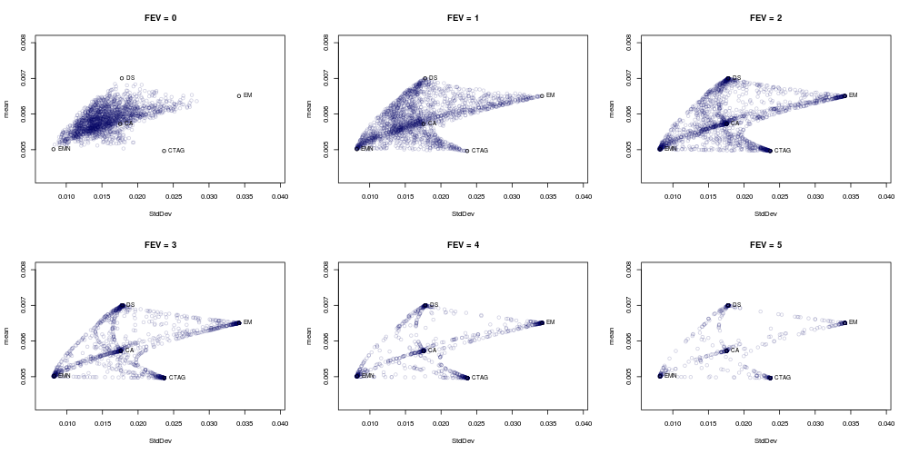

<!--
FEV (Face-Edge-Vertex bias values control how concentrated a portfolio is. This
can clearly be seen in the plot. As FEV approaches infinity, the portfolio
weight will be concentrated on a single asset. PortfolioAnalytics allows you to
specify a vector of fev values for comprehensive coverage of the feasible space. 
-->

---

## Workflow: Specify Portfolio
```{r}
args(portfolio.spec)
```

Initializes the portfolio object that holds portfolio level data, constraints,
and objectives

<!--
The portfolio object is an S3 object that holds portfolio-level data,
constraints, and objectives. The portfolio-level data includes asset names and
initial weights, labels to categorize assets, and a sequence of weights for
random portfolios. The main argument is assets which can be a character vector
(most common use), named numeric vector, or scalar value specifying number of
assets.
-->

---

## Workflow: Add Constraints
```{r}
args(add.constraint)
```

Supported Constraint Types

* Sum of Weights
* Box
* Group
* Factor Exposure
* Position Limit
* and many more

<!--
This adds a constraint object to the portfolio object. Constraints are added to
the portfolio object with the add.constraint function. Each constraint added is
a separate object and stored in the constraints slot in the portfolio object.
In this way, the constraints are modular and one can easily add, remove, or
modify the constraints in the portfolio object. Main argument is the type,
arguments to the constraint constructor are then passed through the dots (...).
-->

---

## Workflow: Add Objectives
```{r}
args(add.objective)
```

Supported Objective types

* Return
* Risk
* Risk Budget
* Weight Concentration

<!--
Objectives are added to the portfolio object with the add.objective function.
Each objective added is a separate object and stored in the objectives slot in
the portfolio object. In this way, the objectives are modular and one can easily
add, remove, or modify the objective objects. The name argument must be a valid
R function. Several functions are available in the PerformanceAnalytics package,
but custom user defined functions can be used as objective functions.
-->

---

## Workflow: Run Optimization
```{r}
args(optimize.portfolio)
args(optimize.portfolio.rebalancing)
```

<!--
* Notice the similarity between these two functions. You only have to specify a
few additional arguments for the backtesting.

* optimize.portfolio: Main arguments for a single period optimization are the
returns (R), portfolio, and optimize_method. We take the portfolio object and
parse the constraints and objectives according to the optimization method.

* optimize.portfolio.rebalancing: Supports periodic rebalancing (backtesting) to
examine out of sample performance. Helps refine constraints and objectives by
analyzing out or sample performance. Essentially a wrapper around
optimize.portfolio that handles the time interface.
-->

---

## Workflow: Analyze Results

Visualization | Data Extraction
------------- | ----------
plot | extractObjectiveMeasures
chart.Concentration | extractStats
chart.EfficientFrontier | extractWeights
chart.RiskReward | print
chart.RiskBudget | summary
chart.Weights | 

<!--
Brief explanation of each function.
-->


---

## Portfolio Optimization

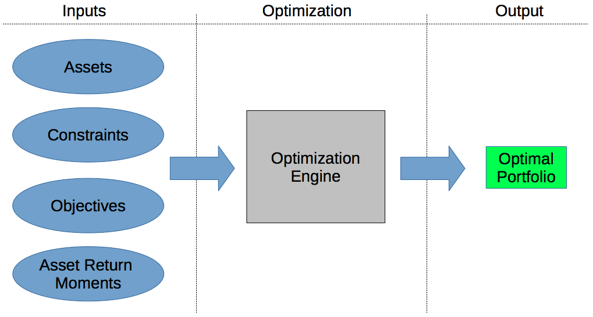


<!--

High level portfolio optimization framework

Inputs
  * Assets
  * Constraints
  * Objectives
  * Moments of asset returns

The assets, constraints, and objectives are defined by the portfolio manager.
In general, these are fixed and there is no estimation or uncertainty. However,
the moments of the asset returns must be estimated. The objectives defined in
the portfolio optimization problem determine which moments and comoments must
be estimated. Moments of the asset returns are key inputs to the optimization.

Beware! Optimizers are error maximizers
Bad Estimates  Bad Results
Better Estimates  Better Results
GIGO (Garbage In Garbage Out)

Mean - Variance
  * expected returns
  * covariance matrix

Minimum Variance
  * covariance matrix

Mean - Expected Shortfall (mean - ES)
  * expected returns vector
  * covariance matrix
  * coskewness matrix
  * cokurtosis matrix
  
If the returns are normally distributed, one can use the analytical formula for
ES which only requires estimates of the first and second moments.

The modified ES (based on Cornish-Fisher expansions) has been shown to deliver
accurate estimates for portfolios with nonnormal returns

For modified ES, one must estimate of the first four moments of the asset 
returns.

Minimum Expected Shortfall
  * expected returns vector
  * covariance matrix
  * coskewness matrix
  * cokurtosis matrix

Same comments as above apply here. The moments to estimate depend on the choice
of the risk measure, e.g. ES vs. modified ES.

Expected Utility
Here the moments to estimate are highly dependent on the choice of utility
function. 

Quadratic Utility
  * expected returns vector
  * covariance matrix

Fourth order expansion of the Constant Relative Risk Aversion (CRRA) 
Utility Function
Martellini and Ziemann (2010) and Boudt et al (2014)
  * expected returns vector (assume zero mean and omit)
  * covariance matrix
  * coskewness matrix
  * cokurtosis matrix

-->

---

## Estimating Moments

Ledoit and Wolf (2003):

> "The central message of this paper is that nobody should be using the sample
> covariance matrix for the purpose of portfolio optimization."


* Sample
* Shrinkage Estimators
* Factor Model
* Expressing Views
* See [Custom Moment and Objective Functions](https://cran.r-project.org/web/packages/PortfolioAnalytics/vignettes/custom_moments_objectives.pdf) vignette


<!--
From Ledoit and Wolf (2003), "Honey, I Shrunk the Sample Covariance Matrix"
The central message of this paper is that nobody should be using the sample 
covariance matrix for the purpose of portfolio optimization.

Estimating moments using shrinkage estimators, factor models, views are methods
to address the disadvantages of using sample estimates. I am not making a claim
that one method is better than another. The method chosen depends on one's own
situation and information/data available.

Increase risk of estimation error as dimension of assets and parameters to
estimate increase

Sample Estimates Disadvantages
  * Estimation error and the curse of dimensionality
  * In the Mean - Variance framework, small changes in expected returns can 
  lead to extreme portfolios (large long/short positions) in the unconstrained
  case and concentrated (large positions in few assets) portfolios wth long
  only constraint.
  * Note that adding constraints have of the effect of lessening the impact of 
  estimation error. TODO: reference? I remember Doug stating this

The estimation of a covariance matrix is unstable unless the number of
historical observations T is greater than the number of assets N. 
10 years of data
daily: 2500
weekly: 520
monthly: 120

One has the choice to estimate moments with historical or simulated data.

Historical Data
  * do you have enough data?
  * missing assets
  * is it clean?

Simulated data
  * Model risk
  * How well does the model describe the data?

* Shrinkage Estimators
  * Ledoit-Wolf
  * James-Stein
* Factor Model
  * Fundamental
  * Statistical
  * Boudt et al (2014) use factor model to estimate higher order comoments
* Expressing Views
  * Black - Litterman
  * Almgren and Chriss, Portfolios from Sorts
  * Meucci, Fully Flexible Views Framework
* Other
  * Resampling
  * ?

-->

---

## Feasible Space Analysis: Data

Here we will analyse the feasible space of allocations to hedge fund strategies

* EDHEC-Risk Alternative Indexes monthly returns from 1/31/1997 to 12/31/2014

Relative Value | Directional
-------------- | ----------- 
Convertible Arbitrage (CA) | CTA Global (CTAG)
Equity Market Neutral (EMN) | Emerging Markets (EM)
Fixed Income Arbitrage (FIA) | Global Macro (GM)
Event Driven (ED) | Distressed Securites (DS)

<!--
* Chosen to represent investing in hedge funds with different styles
* Not necessarily investable
* Style definitions
* what style is event driven and distressed securities?
-->


---

## Feasible Space Analysis: Simple Efficient Frontier
```{r eval=FALSE, tidy=FALSE}
# define base portfolio
portf.base <- portfolio.spec(colnames(R))
portf.base <- add.constraint(portf.base, type="weight_sum",
                             min_sum=0.99, max_sum=1.01)
portf.base <- add.constraint(portf.base, type="box", min=0, max=1)
ef <- create.EfficientFrontier(R, portfolio=portf.base, 
                               type="mean-StdDev", n.portfolios=100)
chart.EfficientFrontier(ef, match.col="StdDev", pch=18, col="lightblue")
```

<!--
define "base portfolio
the only thing I will be changing is constraints so define all the objectives
set multiplier of 0 so the values are calculated, but no optimization is done

-->

---

## Feasible Space Analysis: Simple Efficient Frontier

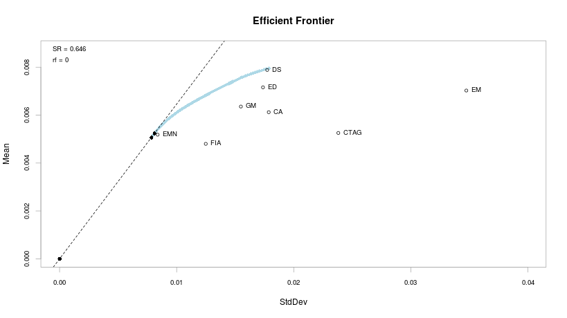

<!--
show the efficient frontier

we can see what the hull looks like, but what does the entire space of feasible
portfolios look like?

full investment and long only constraints
-->

---

## Feasible Space Analysis: Entire Feasible Space
```{r eval=FALSE, tidy=FALSE}
p <- portfolio.spec(colnames(R))
p <- add.constraint(p, type="weight_sum", min_sum=0.99, max_sum=1.01)
p <- add.constraint(p, type="box", min=0, max=1)
p <- add.objective(p, type="return", name="mean", multiplier=0)
p <- add.objective(p, type="risk", name="StdDev", multiplier=0)
rp <- random_portfolios(p, permutations=5000, rp_method='sample')
opt <- optimize.portfolio(R, p, optimize_method="random", rp=rp, trace=TRUE)
xt <- extractStats(opt)
```

<!--
Show code to use random portfolios to see the entire feasible space
setup an optimization, run the optimization, then use the output from 
extractStats to get weights and objectives for every random portfolio
-->

---

## Feasible Space Analysis: Relaxed Constraints
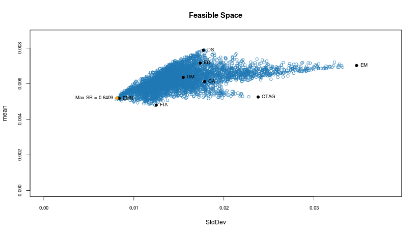


<!--
feasible space with weights sum to 1 and long only constraints
-->

---

## Feasible Space Analysis: Box Constraints

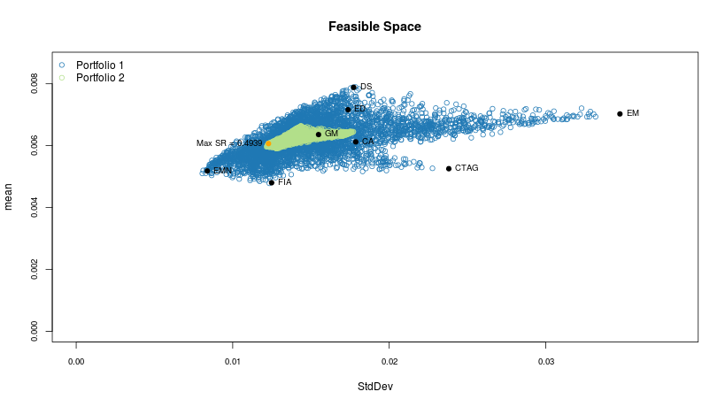


<!--
feasible space with box constraints
-->

---

## Feasible Space Analysis: Long Only and Group Constraints

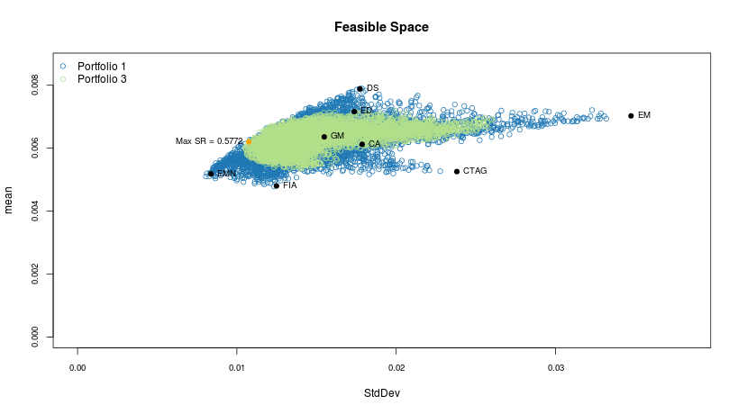


<!--
note that box constraints are relaxed

feasible space with long only and group constraints
-->

---

## Feasible Space Analysis: Long Only and Position Limit Constraints

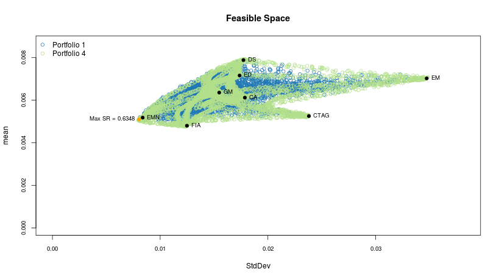


<!--
note that box constraints are relaxed

feasible space with long only and position limit constraints
-->

---

## Feasible Space Analysis: Shorting Allowed and Leverage Constraints

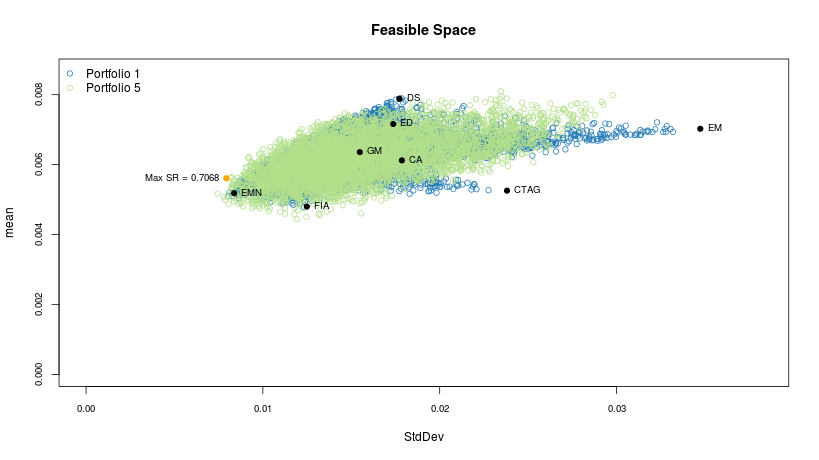


<!--
note that box constraints are relaxed

feasible space with long only and position limit constraints
-->

---

## Heierarchical Optimization Example

Consider an equity long short portfolio

* We first consider a 'naive' model and specify the portfolio and constraints

* Extend the model and separate the portfolio into a long portfolio and a short portfolio

* Further extend the model and use a framework that allows one to express a view and reduce allocation/exposure to the short portfolio


<!--
* focus is on using PortfolioAnalytics to solve the problem, not on the actual
  specification of the portfolio
* assume variable leverage and cost of capital is negligeble
-->

---

## Hierarchical Optimization: Data

Consider an allocation to equity sectors using 9 sector ETFs

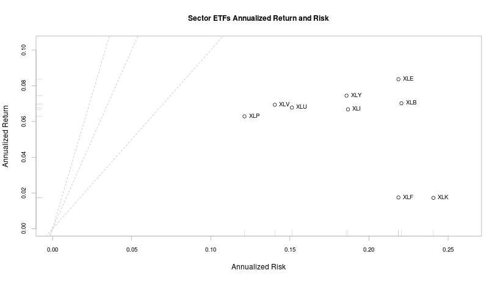

<!--
* Data of the Select Sector SPDR ETFs
* Monthly returns from February 1999 to May 2016 calculated using the adjusted close prices downloaded from Yahoo Finance
-->

---

## Hierarchical Optimization: Naive Portfolio
```{r eval=FALSE, tidy=FALSE}
portf.naive <- portfolio.spec(colnames(R))
portf.naive <- add.constraint(portf.naive, type="weight_sum",
                              min_sum=-0.05, max_sum=0.05)
portf.naive <- add.constraint(portf.naive, type="box", min=-0.5, max=0.5)
portf.naive <- add.constraint(portf.naive, type = "leverage_exposure", leverage=2)
portf.naive <- add.objective(portf.naive, type="risk", name="StdDev")
portf.naive <- add.objective(portf.naive, type="risk_budget",
                             name="StdDev", max_prisk=0.50)
```

<!--
* explain constraints and objectives
* relax sum of weights constraints for +/- 25% net long/short
* assuming variable leverage with max 2:1 leverage
-->

---

## Hierarchical Optimization: Naive Portfolio Optimization
```{r eval=FALSE, tidy=FALSE}
rp.naive <- random_portfolios(portf.naive, permutations=1000, rp_method='sample')
opt.naive <- optimize.portfolio.rebalancing(R, portf.naive,
                                            optimize_method="random",
                                            rebalance_on="quarters",
                                            training_period=36,
                                            rp=rp.naive, trace=TRUE)
# compute arithmetic portfolio returns because of negative weights
ret.naive <- Return.portfolio(R, extractWeights(opt.naive), geometric = FALSE)
colnames(ret.naive) <- "naive.ls"
charts.PerformanceSummary(ret.naive)
```

<!--
TODO: add chart
-->

---

## Hierarchical Optimization: Naive Portfolio Optimization Results

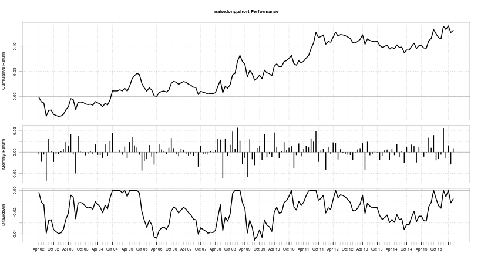

<!--

-->

---

## Hierarchical Optimization: Define Long and Short Portfolio

```{r eval=FALSE, tidy=FALSE}
# long portfolio
p.long <- portfolio.spec(assets=colnames(R))
p.long <- add.constraint(p.long, type="weight_sum", min_sum=0.99, max_sum=1.01)
p.long <- add.constraint(p.long, type="box", min=0, max=0.85)
p.long <- add.objective(p.long, type="risk", name="StdDev")
p.long <- add.objective(p.long, type="risk_budget", name="StdDev", max_prisk=0.50)
rp.long <- random_portfolios(p.long, permutations=1000, rp_method='sample')
# short portfolio
p.short <- portfolio.spec(assets=colnames(R))
p.short <- add.constraint(p.short, type="weight_sum", min_sum=-1.01, max_sum=-0.99)
p.short <- add.constraint(p.short, type="box", min=-0.85, max=0)
p.short <- add.objective(p.short, type="risk", name="StdDev")
p.short <- add.objective(p.short, type="risk_budget", name="StdDev", max_prisk=0.50)
rp.short <- random_portfolios(p.short, permutations=1000, rp_method='sample')
```

<!--

-->

---

## Hierarchical Optimization: Specify Portfolio Heirerarchy

```{r eval=FALSE, tidy=FALSE}
# combined portfolio
p <- portfolio.spec(assets=paste("proxy",1:2, sep="."))
p <- add.constraint(p, type="weight_sum", min_sum=0.99, max_sum=1.01)
p <- add.constraint(p, type="box", min=0.1, max=1)
p <- add.objective(p, type="return", name="mean")
p <- add.objective(p, type="risk", name="StdDev")
rp <- random_portfolios(p, permutations=1000, rp_method='sample')
mult.portf <- mult.portfolio.spec(p)
mult.portf <- add.sub.portfolio(mult.portf, p.long, rp=rp.long, 
                                optimize_method="random", rebalance_on="quarters", 
                                training_period=36)
mult.portf <- add.sub.portfolio(mult.portf, p.short, rp=rp.short, 
                                optimize_method="random", rebalance_on="quarters", 
                                training_period=36)
```

<!--
* focus on the multi-layer specification
-->

---

## Hierarchical Optimization: Long and Short Portfolio Optimization
```{r eval=FALSE, tidy=FALSE}
# run the optimization
opt.m.ls <- optimize.portfolio.rebalancing(R, mult.portf,
                                           optimize_method = "random",
                                           trace = TRUE, rp = rp,
                                           rebalance_on = "quarters",
                                           training_period = 36)
r.ls <- Return.portfolio(opt.m.ls$R, extractWeights(opt.m.ls), geometric = FALSE)
charts.PerformanceSummary(r.ls)
```


---

## Hierarchical Optimization: Long and Short Portfolio Optimization Results
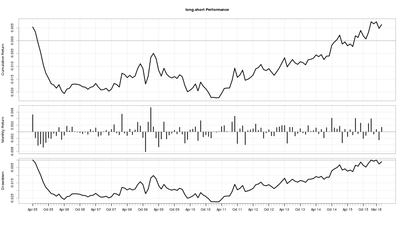

<!--
grab code from pa_opt_views.R
-->

---

## Hierarchical Optimization: Long/Short Portfolio with View

* Define an indicator for overall market direction
  * 12 period exponentially weighted moving average on monthly closing prices of SPY
* Use the trend indicator for a simple regime model
  * Regime 1: Price >  EMA (Uptrend)
  * Regime 2: Price <= EMA (Downtrend)
* Define the portfolio optimization problem such that we reduce exposure to the short portfolio when in regime 1

<!--
* same setup as before but now we are using the regime switching framework to
  express a view on the direction of the market
* 12M EMA on SPY
* Only reducing exposure because we want to protect against
-->

---

## Hierarchical Optimization: Long/Short Portfolio with View Specification
```{r eval=FALSE, tidy=FALSE}
p.short.1 <- portfolio.spec(assets=colnames(R))
p.short.1 <- add.constraint(p.short.1, type="weight_sum",
                            min_sum=-0.26, max_sum=-0.24)
p.short.1 <- add.constraint(portfolio=p.short.1, type="box", min=-0.25, max=0)
p.short.1 <- add.objective(portfolio=p.short.1, type="risk", name="StdDev")
p.short.1 <- add.objective(p.short.1, type="risk_budget",
                           name="StdDev", max_prisk=0.50)
p.short.2 <- p.short
# define the portfolios for the regime model
# regime 1: Price >  EMA ; regime 2: Price <= EMA
trend.ind <- na.omit(cbind(Ad(SPY), TTR::EMA(Ad(SPY), n = 12)))
regime <- ifelse(trend.ind$SPY.Adjusted > trend.ind$EMA, 1, 2)
regime.port <- regime.portfolios(regime, combine.portfolios(list(p.short.1, p.short.2)))
```

<!--

-->

---

## Hierarchical Optimization: Long/Short Portfolio with View Optimization
```{r eval=FALSE, tidy=FALSE}
p <- portfolio.spec(assets=paste("proxy",1:2, sep="."))
p <- add.constraint(p, type="weight_sum",min_sum=0.99, max_sum=1.01)
p <- add.constraint(p, type="box", min=0.1, max=1)
p <- add.objective(p, type="return", name="mean")
p <- add.objective(p, type="risk", name="StdDev")
rp <- random_portfolios(p, permutations=1000, rp_method='sample')

# initialize multi-layer (i.e. hierarchical) portfolio specification
mult.portf <- mult.portfolio.spec(p)
mult.portf <- add.sub.portfolio(mult.portf, p.long, rp=rp.long,
                                optimize_method="random", rebalance_on="quarters",
                                training_period=36)
mult.portf <- add.sub.portfolio(mult.portf, regime.port,
                                search_size = 1000, optimize_method="random", 
                                rebalance_on="quarters", training_period=36)
```

<!--
use code from pa_opt_views.R
-->

---

## Hierarchical Optimization: Long/Short Portfolio with View Optimization
```{r eval=FALSE, tidy=FALSE}
opt.mr.ls <- optimize.portfolio.rebalancing(R, mult.portf,
                                            optimize_method = "random",
                                            trace = TRUE, rp = rp,
                                            rebalance_on = "quarters",
                                            training_period = 36)
r.ls.regime <- Return.portfolio(opt.mr.ls$R, extractWeights(opt.mr.ls), geometric = FALSE)
ret.all <- na.omit(cbind(ret.naive, r.ls, r.ls.regime))
charts.PerformanceSummary(ret.all)
```


---

## Hierarchical Optimization: Long/Short Portfolio with View Optimization Results
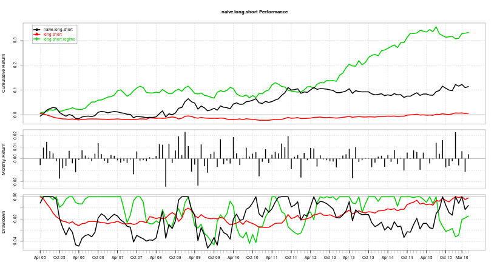

<!--
summarize the models and the results
-->

---

## Conclusion

* Introduced the goals and summary of PortfolioAnalytics
* Demonstrated the flexibility through examples
* Plans for continued development
    * Interface to $parma$
    * Additional solvers
    * "Gallery" of examples

#### Acknowledgements
Many thanks to...

* Google: funding Google Summer of Code (GSoC) for 2013 and 2014
* UW CF&RM Program: continued work on PortfolioAnalytics
* GSoC Mentors: Brian Peterson, Peter Carl, Doug Martin, and Guy Yollin
* R/Finance Committee

<!---
Hammer home the point of modular architecture and ability to "plug" custom
moments and objective functions to define your own optimization problems
- One of the best things about GSoC is the opportunity to work and interact
with the mentors.
- Thank the GSoC mentors for offering help and guidance during the GSoC project
and after as I continued to work on the PortfolioAnalytics package.
- R/Finance Committee for the conference and the opportunity to talk about
PortfolioAnalytics.
- Google for funding the Google Summer of Code for PortfolioAnalytics and many
other proposals for R

Thank everyone for attending
I hope they learned something and are motivated to use PortfolioAnalytics
-->

---

## PortfolioAnalytics Links

* [PortfolioAnalytics on CRAN](http://cran.at.r-project.org/web/packages/PortfolioAnalytics/index.html)

* [PortfolioAnalytics on GitHub](https://github.com/braverock/PortfolioAnalytics)

Source code for the slides

* https://github.com/rossb34/PortfolioAnalyticsPresentation2016

and view it here

* http://rossb34.github.io/PortfolioAnalyticsPresentation2016/

---

## Any Questions?

---

## References and Useful Links

* [ROI](http://cran.r-project.org/web/packages/ROI/index.html)
* [DEoptim](http://cran.r-project.org/web/packages/DEoptim/index.html)
* [pso](http://cran.r-project.org/web/packages/pso/index.html)
* [GenSA](http://cran.r-project.org/web/packages/GenSA/index.html)
* [PerformanceAnalytics](http://cran.r-project.org/web/packages/PerformanceAnalytics/index.html)
* [Patrick Burns Random Portfolios](http://www.burns-stat.com/pages/Finance/randport_practice_theory_annotated.pdf)
* [W.T. Shaw Random Portfolios](http://papers.ssrn.com/sol3/papers.cfm?abstract_id=1856476)
* [Improved Forecasts of Higher-Order Co-moments and Implications for Portfolio Selection](http://docs.edhec-risk.com/EAID-2008-Doc/documents/Higher_Order_Comoments.pdf)
* [Higher Order Comoments of Multifactor Models and Asset Allocation](http://papers.ssrn.com/sol3/papers.cfm?abstract_id=2409603)
